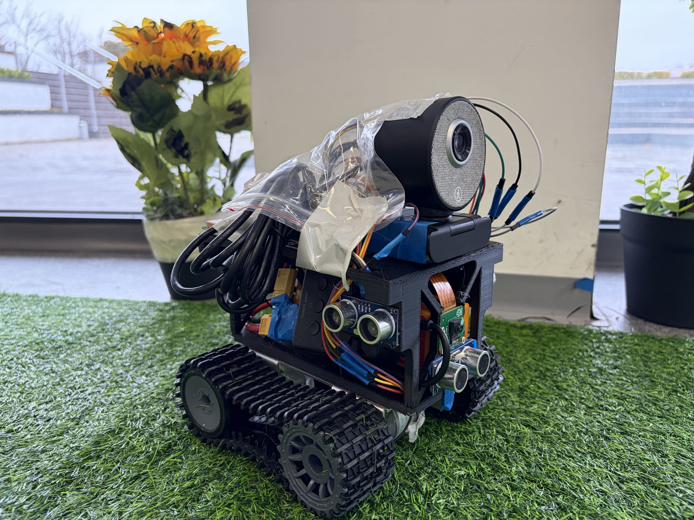
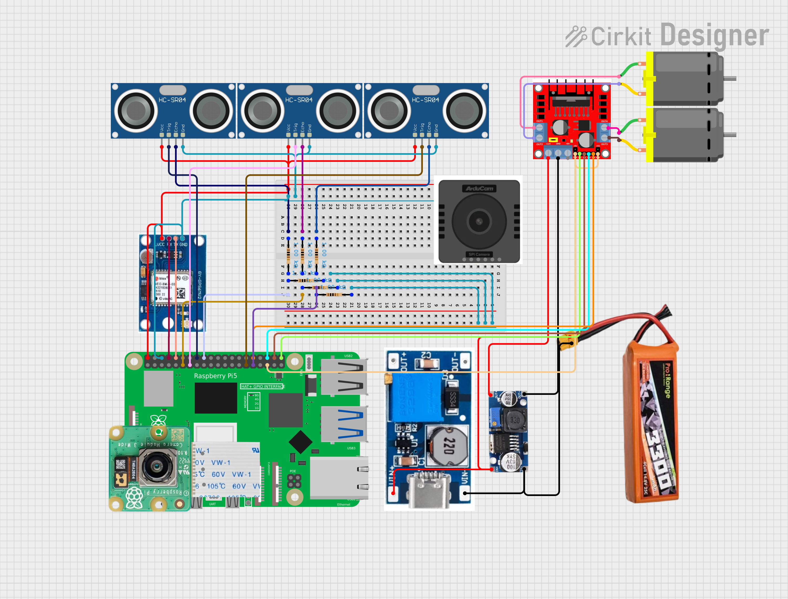
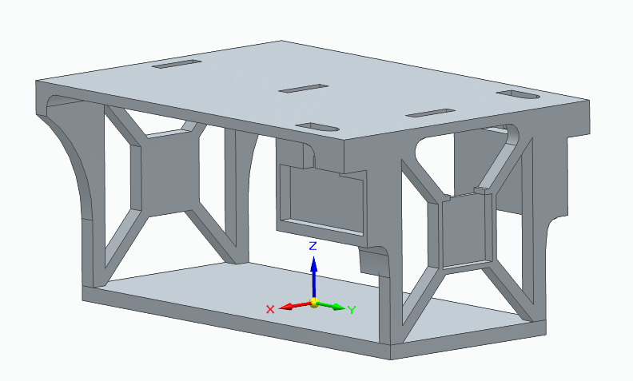

# Tracky

Tracky is a compact autonomous rover for crop monitoring. It moves between rows, detects suspicious plants, tags them with GPS, and sends the result to a mobile app where the farmer sees the issue on a map and confirms or corrects the diagnosis.

## What it does

- Cheap tracked rover built around Raspberry Pi 5
- Plant detection + anomaly screening pipeline
- Spring Boot backend with realtime updates
- Native iOS app for map-based crop issue review
- Farmer feedback loop that improves future recommendations

## Core Idea

Large agricultural robots are expensive and overkill for many farms. Tracky is built as a small scout rover that focuses on one thing: finding problems early and showing exactly where they are.

## Main Flow

1. Tracky drives through the field and watches plants up close.
2. It detects suspicious or unhealthy-looking crops with its cameras.
3. Each finding is paired with GPS location and image evidence.
4. The mobile app shows the issue directly on a map for the farmer.
5. The farmer reviews the image and either confirms or corrects the diagnosis.
6. That feedback improves future recommendations.

## Why it matters

- Earlier disease detection before spread
- Less wasted spraying and more targeted intervention
- Lower monitoring cost for small and mid-sized farms
- Better data collected from real field usage, not only static datasets

## Prototype

## Hardware

- Raspberry Pi 5
- Tank-track chassis
- 2 cameras
- 3 ultrasonic sensors
- GPS module
- Motor driver + DC motors
- Battery + power regulation
- Planned LoRa, probe, and targeted spray add-ons

## Stack

- `embedded/` rover control, sensors, GPS, motors, cameras
- `plant_pipeline/` plant localization and anomaly detection
- `server/` auth, plant reports, feedback, WebSockets
- `patatnikClient/` iOS app with Apple Maps
- `rl/` reinforcement learning experiments for autonomous navigation

## Product Vision

Tracky is designed to become a low-cost agricultural scout:

- autonomous enough to inspect rows without constant manual driving
- precise enough to report where the problem is
- practical enough to help the farmer take action immediately
- smart enough to get better as more feedback is collected

## Status

This repo already contains the rover-side code, the vision pipeline, the backend, and the iOS client. The remaining work is mostly integration, field reliability, and tighter packaging for the demo.
